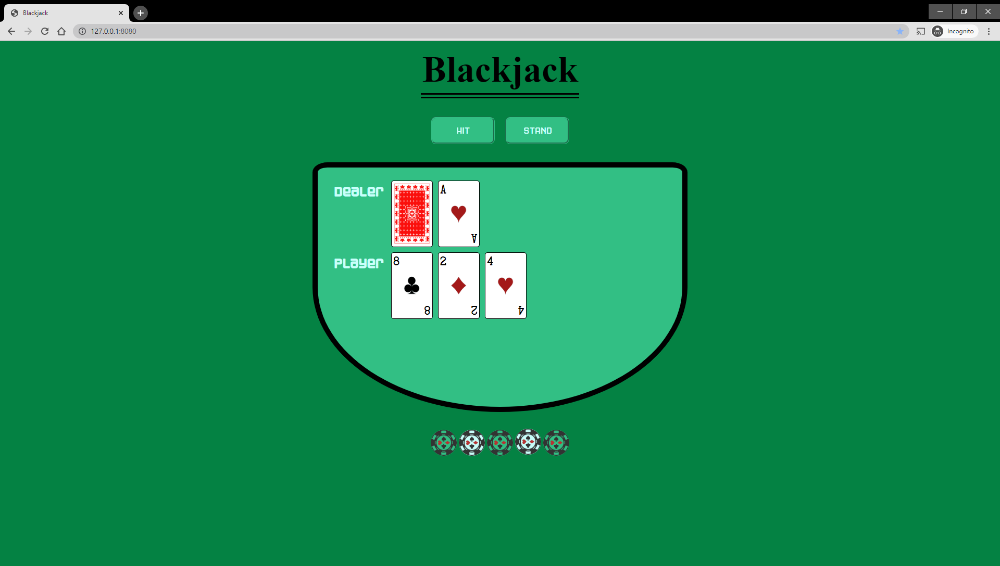
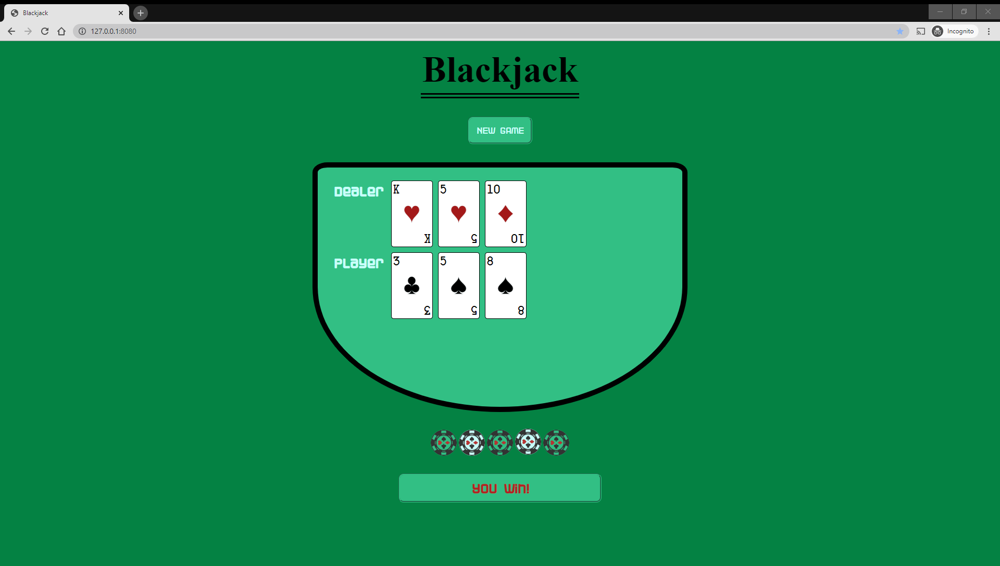
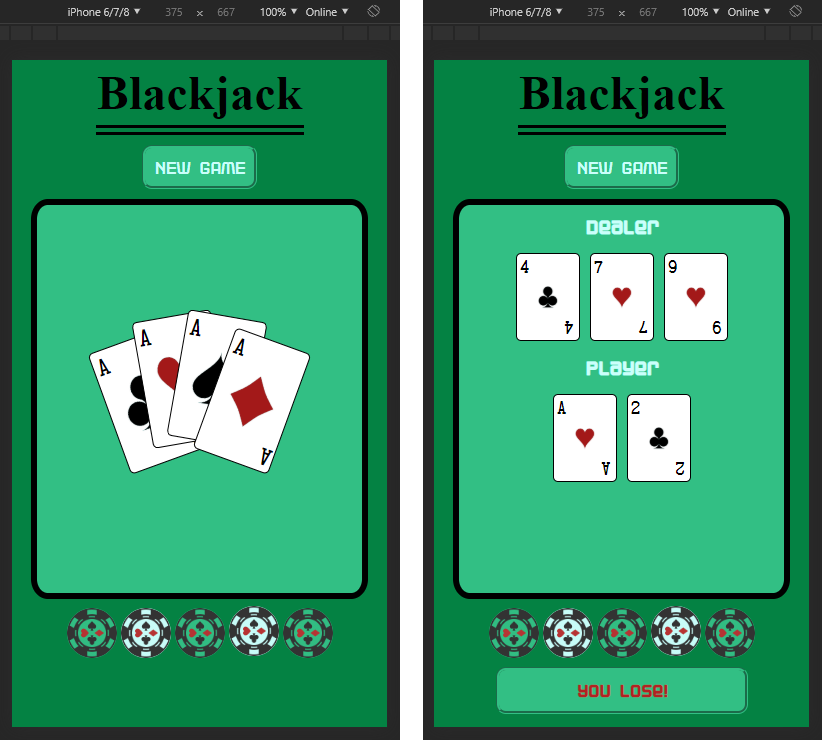

# 
Blackjack - The Final Countdown
  

## 
Our first Team-Project made by:
  

 <h3><strong>Ioannis:</strong>JS contributor</h3> 

 <h3><strong>Nathan:</strong> JS contributor</h3> 

 <h3><strong>Marcelo:</strong> CSS contributor</h3> 

 <h3><strong>Yaman:</strong>CSS contributor</h3> 

  

## 
An enjoyable card game to play in your browser written with HTML, CSS/Sass and Vanilla JS (no libraries).
  

## A reference to an interesting algorithm we used

We used the the modern version of the Fisher–Yates shuffle, the algorithm to generate a random sequence with our cards. The new algorithm, was designed for computer use by Richard Durstenfeld in 1964 and popularized by Donald E. Knuth. The basic method given for generating a random permutation of the numbers 1 through N goes as follows:

- Write down the numbers from 1 through N.
- Pick a random number k between one and the number of unstruck numbers remaining (inclusive).
- Counting from the low end, strike out the kth number not yet struck out, and write it down at the end of a separate list.
- Repeat from step 2 until all the numbers have been struck out.
- The sequence of numbers written down in step 3 is now a random permutation of the original numbers.

The algorithm described by Durstenfeld differs from that given by Fisher and Yates in a small but significant way. Whereas a naïve computer implementation of Fisher and Yates' method would spend needless time counting the remaining numbers in step 3 above, Durstenfeld's solution is to move the "struck" numbers to the end of the list by swapping them with the last unstruck number at each iteration

## Game instructions

- The card deck is generated and then shuffled before the start of the game.
- Ace as a special card is evaluated as "1" or "11" depending on player cards in hand.
- Player and dealer can't get any more cards after he reaches "21" or gets passed it.
- There is phase One with two cards for the player and the dealer. Then the player decides what to do, hit or stand.
- Only one card of the dealer is visible in phase One. Afterwards, the rest are being revealed as the game progresses.
- At the end who ever is closer to 21 wins or being burst for exceeding the 21 point limit.

## Blackjack game overview:

Blackjack, also known as twenty-one, is a comparing card game between usually several players and a dealer, where each player in turn competes against the dealer, but players do not play against each other. It is played with one or more decks of 52 cards, and is the most widely played casino banking game in the world. The objective of the game is to beat the dealer in one of the following ways:

1. Get 21 points on the player's first two cards (called a "blackjack" or "natural"), without a dealer blackjack;
2. Reach a final score higher than the dealer without exceeding 21; or
3. Let the dealer draw additional cards until their hand exceeds 21.

You can find more info about the game in [Wikipedia](https://en.wikipedia.org/wiki/Blackjack)
